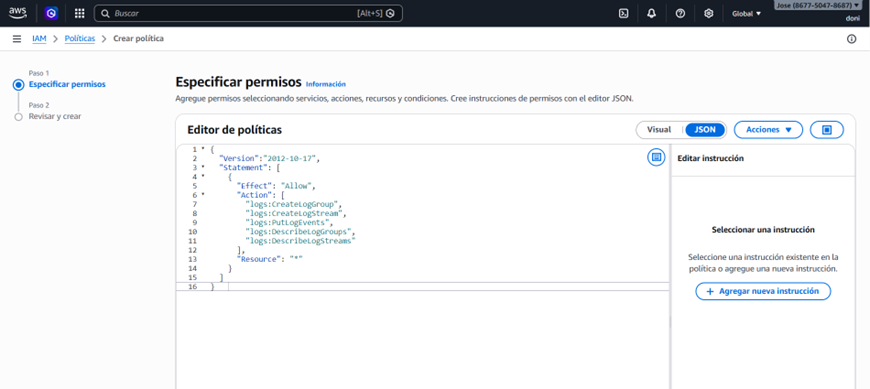
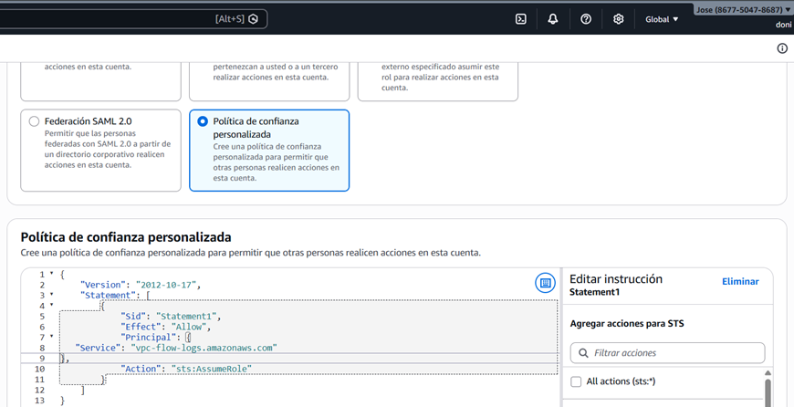
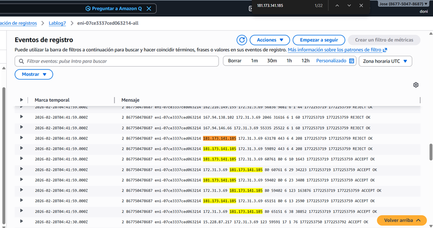
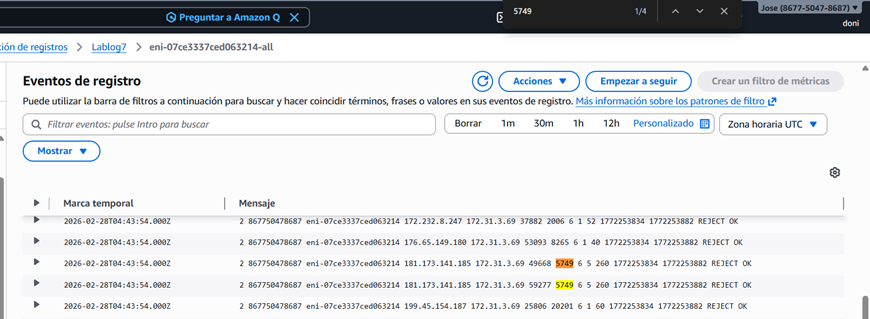
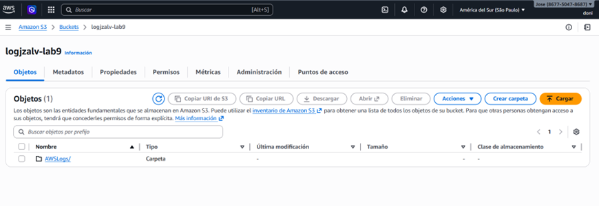
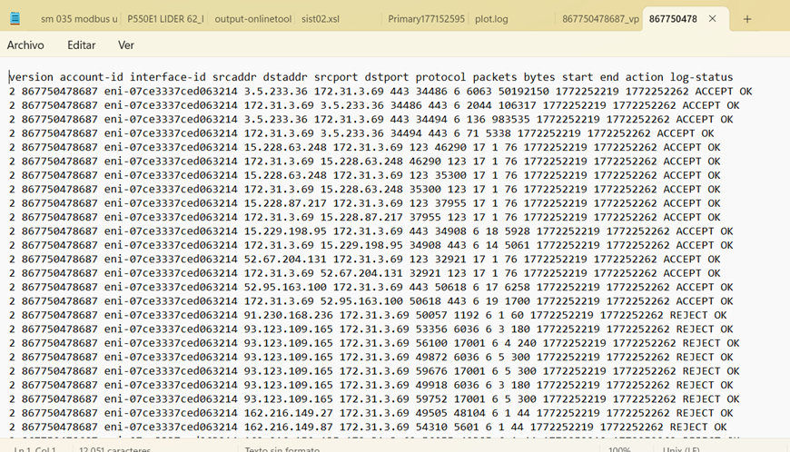

# Auditoria-de-Red-en-AWS-VPC-Flow-Logs

Este proyecto documenta la implementación de un sistema de auditoría de red en AWS mediante **VPC Flow Logs**. El objetivo es capturar y analizar el tráfico IP que entra y sale de las interfaces de red, permitiendo diagnosticar problemas de conectividad y fortalecer la seguridad perimetral.

## 🎯 Escenario Técnico
Se desplegó una infraestructura compuesta por una VPC con subredes públicas, donde se aloja una instancia EC2 ejecutando una aplicación contenedorizada (**OWASP Juice Shop**). Para auditar el tráfico, se configuró el envío de registros hacia dos destinos:
*   **Amazon CloudWatch Logs:** Para análisis operativo y búsqueda de eventos en tiempo real.
*   **Amazon S3:** Para almacenamiento persistente y cumplimiento normativo.

## 🛡️ Configuración de Seguridad e IAM
Para habilitar el flujo de datos, se implementó un modelo de seguridad basado en el principio de menor privilegio:
*   **Política `Logs-lab7`:** Permite la creación y publicación de flujos de registros en CloudWatch.

  
*   **Rol de Servicio `Rol-lablogs`:** Utiliza una relación de confianza que permite específicamente al servicio `vpc-flow-logs.amazonaws.com` realizar acciones en la cuenta.

  

## 🔍 Caso de Uso: Resolución de Incidentes (Troubleshooting)
Durante el despliegue de la aplicación en el puerto **5749**, se detectó un error de tipo `CONNECTION TIMED OUT`. 

### Diagnóstico con Flow Logs:
Mediante consultas en el grupo de registros `Lablog7`, se identificó el tráfico proveniente de la IP del cliente (`181.173.141.185`):
1.  **Filtro de Tráfico:** Se analizaron los eventos filtrando por la acción `REJECT`.

2.  **Hallazgo:** Los registros confirmaron que los paquetes hacia el puerto 5749 estaban siendo bloqueados sistemáticamente (`REJECT OK`).
   
3.  **Implementacion:** Los Logs fueron almacenados tanto en registros de Cloudwatch, como de S3. A continuación se evidencia su implementación funcional y resultados a partir del despliegue.

   
   

## 🛠️ Tecnologías Utilizadas
*   **AWS VPC:** Flow Logs, Subnets, Routing Tables.
*   **AWS IAM:** Custom Policies & Roles.
*   **Monitoring:** CloudWatch Logs & Amazon S3.
*   **Compute & Docker:** Despliegue de aplicaciones mediante AWS CLI y contenedores.

---
*Este laboratorio forma parte del programa de Arquitectura y Seguridad Cloud.*
